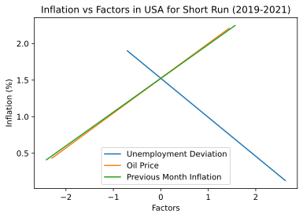
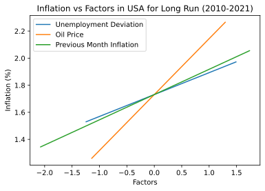
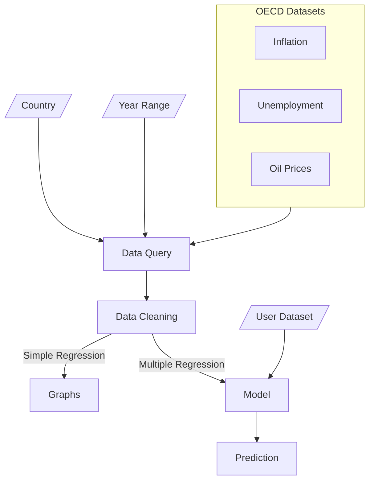

[toc]

# Introduction

Economy faces a short-run trade-off between inflation and unemployment

Short run: period where contracts cannot be renegotiated
Long run: a long period (5yrs or so) which contains multiple renegotiations of contracts

## Inflation

Rate at which prices of commodities increase

## Unemployment

the fraction/proportion of people seeking jobs but cannot get

does **not** include people who aren't seeking jobs

## Phillips Curve Relation

y-axis = inflation
x-axis = unemployment

Inflation $\propto \frac{1}{\text{Unemployment}}$

$$
\pi_t = \alpha - \beta U_t \qquad  (\pi_t = - \beta U_t + \alpha, \ y = mx+c)\\

\text{Taking derivative wrt t}\\
\frac{d \pi_t}{d t} = - \beta
$$

- $\pi_t =$ Inflation
- $\alpha =$ inflation when there is no unemploment
- $\beta =$ cost for reducing unemployment by a unit
- $U_t =$ actual rate of unemployment

This relation is only short-run
for long run, whatever is the inflation, unemployment remains constant = natural unemployment
the graph will be a straight line parallel to the y-axis

During short run, the contracts for raw materials, employees is fixed
but prices for commodity increases
therefore, producers increase production to maximize profit (misperception by producers); this is done by increasing employees
Unemployment rate decreases

Moreover, workers suffer money illusion (only focus on the nominal income increase;  don’t realize that the real income is the same)

Then in the long run, few months later, the employees will renegotiate for higher wages; then the producers will hesitate as they no longer see the attraction for producing at such large volume and paying such wages; so they fire employees; therefore, the unemployment rate will increase again

# Project

## Aim

1. To plot the graph showing the relationship in short run and long run for
   1. Inflation vs Deviation in unemployment
   2. Inflation vs Oil Price
   3. Inflation vs Expectation/Previous Month’s Inflation
2. Obtain a multiple linear regression model to predict inflation

## Purpose

To practice using python to analyze economic data

## Outputs





# Code

## Importing

In order to simplify the project, external libraries are imported. The required datasets are also imported.

``` python
import warnings
warnings.filterwarnings('ignore')

from IPython.display import display, Math, Latex

from sklearn.linear_model import LinearRegression
model = LinearRegression()

import matplotlib.pyplot as plt
%matplotlib inline

import pandas as pd
ids = pd.read_csv("../ds/inflation.csv").query("""
    INDICATOR == 'CPI' and MEASURE == 'AGRWTH' and SUBJECT == 'TOT'
""")

uds = pd.read_csv("../ds/unemployment.csv").query("""
    SUBJECT == 'TOT'
""")

ods = pd.read_csv("../ds/oil.csv")
```

## Criteria

The countries and the range of the years is inserted here

```python
country = "USA"
factors = ["Unemployment Deviation", "Oil Price", "Previous Month Inflation"]

sy = 2019 # 3 years
ly = 2010 # 10 years
ey = 2021 # excluding this year

endYear = str(ey)
endPrevYear = str(ey - 1)
places = 3 # decimal Places
```

## IDK

``` python
class run:
    i = 5
    u = 5
    o = 5
    e = 5
    text = ""
    file = ""
    query = ""
    year = ""
    prevYear = ""
    freq = ''

s = run()
s.year = str(sy)
s.prevYear = str(sy - 1)
s.freq = 'M'
s.text = "Short Run"
s.file = "sr"


l = run()
l.year = str(ly)
l.prevYear = str(ly - 1)
l.freq = 'A'
l.text = "Long Run"
l.file = "lr"

runs = [s, l]
```

## Querying

Using the above criteria, queries are run to get only the required data

```python
for run in runs:
    run.query = """
        TIME > @run.year and TIME < @endYear and FREQUENCY == @run.freq
    """
    run.i = ids.query(run.query)
    run.u = uds.query(run.query)
    run.o = ods.query(run.query)
    run.e = ids.query("""
        TIME > @run.prevYear and TIME < @endPrevYear and FREQUENCY == @run.freq
    """)

    i = run.i.query("LOCATION == @country")["Value"].reset_index(drop=True)

    u = run.u.query("LOCATION == @country")["Value"].reset_index(drop=True)
    uDev = u - u.mean()
    run.uMean = u.mean() # needed for finding dataset unemployment deviation

    o = run.o.query("LOCATION == @country")["Value"].reset_index(drop=True)

    iprev = run.e.query("LOCATION == @country")["Value"].reset_index(drop=True)[0]
    if iprev is None: # data not available
        e = pd.Series( i.mean() )
    else:
        e = pd.Series( iprev ) 
    e = e.append(i, ignore_index=True).iloc[:-1]

    run.frame = { 
        factors[0]: uDev,
        factors[1]: o,
        factors[2]: e,

        "Current Inflation": i,
    }
    run.df = pd.DataFrame(run.frame)

    run.normalizedFrame = { 
        factors[0]: ( uDev - uDev.mean() )/uDev.std(),
        factors[1]: ( o - o.mean() )/o.std(),
        factors[2]: ( e - e.mean() )/e.std(),

        "Current Inflation": i,
    }
    run.normalizedDf = pd.DataFrame(run.normalizedFrame)
```

## Graph

Graph with respect to individual factors, by calculating relation using Simple Linear Regression

```python
text = "Factors"#"($ u- \overline{u}$ )"
for run in runs:
    plt.figure(dpi=150).patch.set_facecolor('white')
    for factor in factors:
        x = run.normalizedDf[[ factor ]]
        model.fit(x, run.normalizedDf["Current Inflation"])
        plt.plot(x, model.predict(x), label = factor)

    plt.title(
        "Inflation vs " + text + " in " + country + " for " + run.text + " (" + run.year + "-" + endYear + ")"
    )
    plt.xlabel(text), plt.ylabel("Inflation (%)"), plt.legend()

    plt.savefig("../img/" + run.file + ".svg", dpi=300, bbox_inches = 'tight')
    plt.show()
```

## Training

Calculate relation using Multiple Linear Regression

``` python
model.fit(s.df[factors], s.df["Current Inflation"])

print("The regression equation in", s.text, "for", country)

display(Math(r"\pi_t = " +
    str( round( model.intercept_, places) ) +
    str( round(model.coef_[0], places) ) + "( u_t - \overline u )" +
    "+" + str( round(model.coef_[1], places) ) + "( O_t )" +
    "+" + str( round(model.coef_[2], places) ) + "( \pi_{t-1} )" 
))

print("(Rounded-off to", places, "places for viewing)")
```

## Comparing Model with Training Set

Rounded to 3 decimal places

``` python
s.df["Predicted Inflation"] = model.predict( s.df[factors] )

s.df["% Error"] = 100 * (s.df["Predicted Inflation"] - s.df["Current Inflation"]) / s.df["Current Inflation"]

print("Comparing model with the first few observations of training set in", s.text)

round(s.df.head(), places)
```

## Using model for test set

Rounded to 3 decimal places

``` python
print("Using model for test set in", s.text)

# test = pd.read_csv("../ds/test.csv")
test = pd.read_excel("../ds/test.xlsx")

test[factors[0]] = test.iloc[:, 0] - s.uMean
test["Predicted Inflation"] = model.predict( test[factors] )

round(test, places)
```

# Flowchart



# Conclusions

- Got an equation of the form
    $\pi_t = \beta_0 + \beta_1(u_t - \bar u ) + \beta_2 O_t + \beta_3 \pi_{t-1}$, where
   - $\pi_t =$ inflation of current year
   - $u_t - \bar u =$ deviation of unemployment from mean unemployment
   - $O_t =$ oil price (price of supplementary commodity)
   - $\pi_{t-1} =$ inflation of previous year (helps incorporate expectation)
- Relation with Factors
    1. Unemployment
        - Inflation $\propto \frac 1 {\text{Unemployment}}$ in short run
        - Inflation is not necessarily related to unemployment in long run
    2. Inflation $\propto$ Oil Price
    3. Inflation $\propto$ Expectation (Previous Inflation)

# Data Sets

The datasets for this project were acquired from [OECD’s data website](https://data.oecd.org)

- [Unemployment Dataset](https://data.oecd.org/unemp/unemployment-rate.htm)

- [Inflation Dataset](https://data.oecd.org/price/inflation-cpi.htm)

- [Crude Oil Import Prices Dataset](https://data.oecd.org/energy/crude-oil-import-prices.htm)

# References

1. [Multiple Linear Regression](https://euanrussano.github.io/20190810linearRegressionNumpy/)
